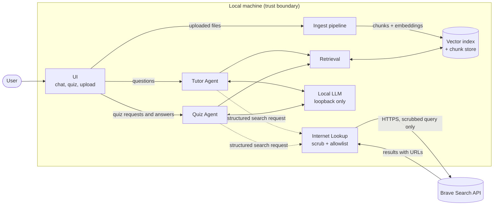
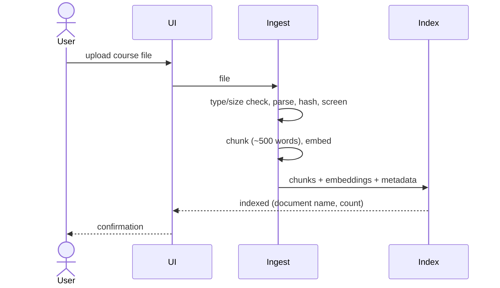
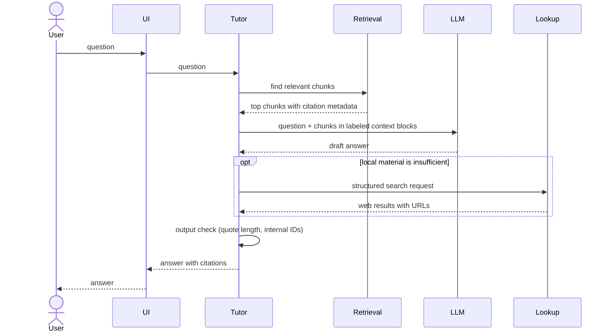
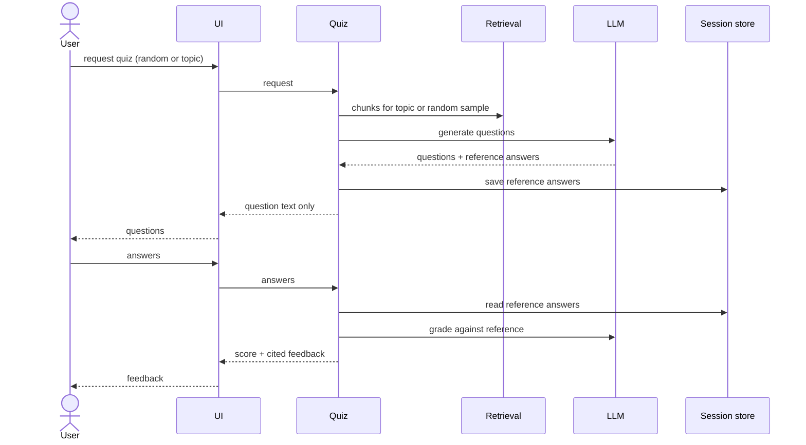
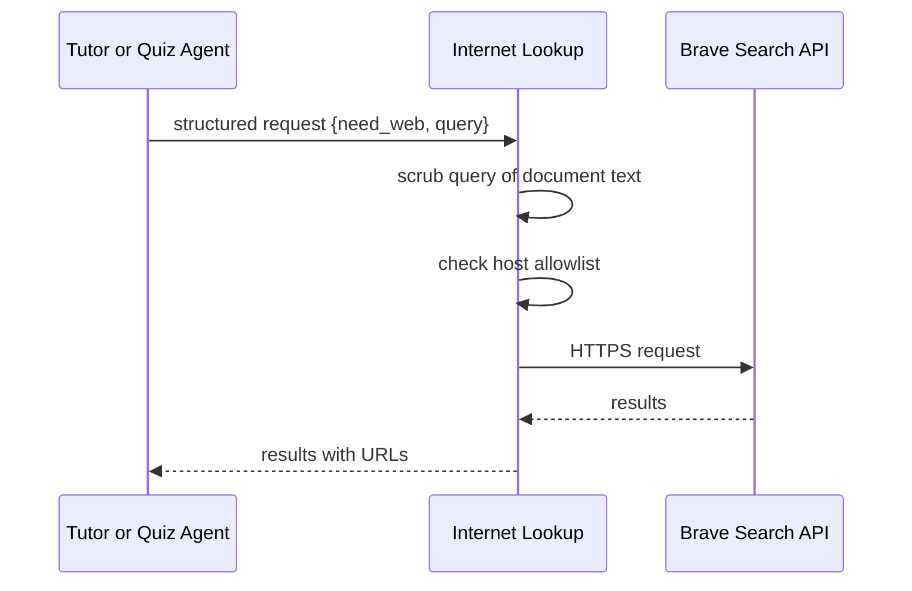
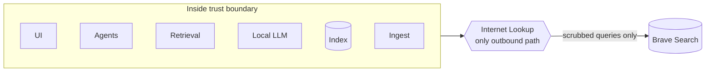

# Architecture

Status: High-level draft. Component roles and communication are set. Process layout, model runtime, and storage details are still open (see section 5).

## 1. Overview

TutorAndQuizBot is a local question-answering and quiz system for network security course material. A user uploads course files, asks questions, and takes quizzes. Answers and feedback cite the source documents. Course content stays on the local machine. The only outbound connection is the Internet Lookup module, which sends scrubbed search queries and never receives document content.

## 2. Components and Communication

Solid arrows show the normal data path. Dashed arrows show a request that goes through the Internet Lookup module, which is the only component allowed to reach the network.

| Component | Role |
|---|---|
| UI | Single interface for chat, quiz sessions, and document upload |
| Tutor Agent | Answers questions from retrieved material, with citations |
| Quiz Agent | Generates quizzes, holds reference answers, grades responses, gives cited feedback |
| Retrieval | Finds the most relevant chunks for a question or quiz topic |
| Vector index and chunk store | Holds embeddings and chunk text with source metadata |
| Ingest pipeline | Validates, parses, screens, hashes, chunks, embeds, and indexes files |
| Local LLM | One local Llama model serving both agents |
| Internet Lookup | Scrubs outbound queries, enforces the host allowlist, returns cited results |

## 3. Main Flows

### 3.1 Ingestion

Each chunk keeps its document name, section heading, and page or slide number, so citations can point to a specific location.

### 3.2 Tutor Question

The model treats retrieved text as reference material, not as instructions.

### 3.3 Quiz

Reference answers never leave the server side before the user submits.

### 3.4 Internet Lookup

Agents never make network calls themselves. They only send structured requests to the lookup module.

## 4. Trust Boundary

Everything except the Internet Lookup module stays inside the boundary. The threat model describes the risks at this boundary.

## 5. Open Items

These are deliberately left open until the team agrees on them.

- **Process layout.** The system will run as several processes, but the split and the communication method depend on the team's operating systems (Windows, Linux, macOS).
- **Model runtime.** Candidates include the llama.cpp server, Ollama, and llama-cpp-python. Cross-platform setup effort will drive the choice.
- **One model or two.** Current plan is one base model with two prompt profiles. Separate adapters remain possible.
- **Vector store.** Faiss is the planned option. The encrypted-at-rest approach for the bonus build depends on this choice.
- **Citation granularity.** Page or slide numbers are likely sufficient, but PDF section detection may need work.
- **Ingest isolation.** Whether parsing runs in a separate process depends on the process layout decision and on whether malicious file ingestion becomes R4.
